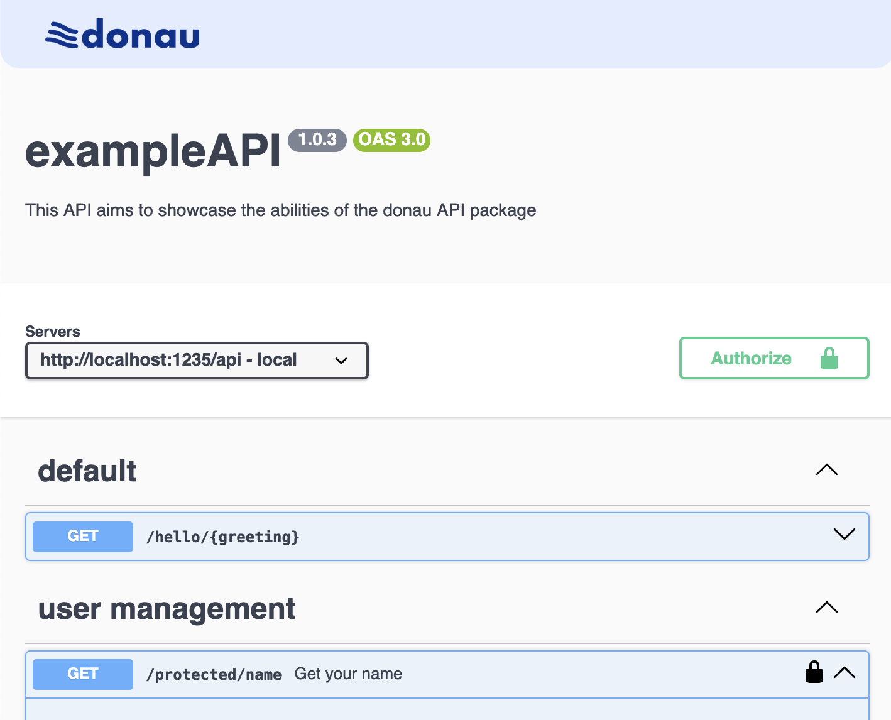

<br><br>

# **donau** &nbsp;&nbsp;&nbsp;&nbsp; REST API framework

a lightweight framework for defining and running REST APIs. It is based on express and automatically generates and serves an open api documentation.

__

## features

- usable as standalone server or with existing `express`
- automatic Open API documentation generation/serving
- out-of-the-box **auth** handling
  - JWT authentication
  - Basic authentication
- simple and sleek developer experience
- type safe
- easy to use and extend
- integrated logging via `logger`

## usage

check out the example project at `/example`

- `minimal_example` provides a rudimentary API serving just one endpoint
- `auth_example` provides a more complex API that defines nested endpoints and handles user authentication

### simple example

an api can be defined and served just by:

defining the routes:

```typescript
const routes: DonauRoute[] = [
  route("/hello/{greeting}", {
    description: `A simple hello world route`,
    parameters: [
      parameterPath("greeting", {
        description: "the greeting phrase",
      }),
    ],
    worker: (greeting) => {
      return greeting === "bye"
        ? err.badRequest("don't say bye")
        : { message: `${greeting}, my friend!` };
    },
  }),
];
```

and then configuring the API

```typescript
donauServerRun(1235 /* the port */, {
  info: {
    title: "basicAPI",
    version: "1.0.3",
    description: "an example API",
  },
  routes: routes,
});
```

### authentication

you can of course provide your own authentication middleware to the server. but for convenience, the framework provides a prebuilt way to handle authentication. you can define a `new JWTAuth` object and pass it to the `donauServerRun` function:

```typescript

const jwtAuth = new JWTAuth({
  secretKey: "mySecretKey",
  // remove onSignUp if you don't want to allow sign up
  onSignUp: async (req, res) => {...},
  // this provides a rich user object to your routes
  getUser: async (username) => {...},
  // load the password hash from your database
  getPasswordHash: async (username) => {...},
})


donauServerRun(1235, {
  info: {
    title: "basicAPI",
    version: "1.0.3",
    description: "an example API",
  },
  routes: [
    ...yourRoutes,
    ...jwtAuth.routes, // this adds the auth routes to your API

    ],
  // this adds the auth middleware to your API
  auth: jwtAuth.middleware,
});
```

you can then use the `handlerAuthed` function to define protected routes

## contribution

you are most welcome to suggest improvements or contribute code via the [github repository](https://github.com/RobinNaumann/donau)

_I hope this package is useful to you,_<br>
_Yours, Robin_

[](https://robbb.in/donate)
